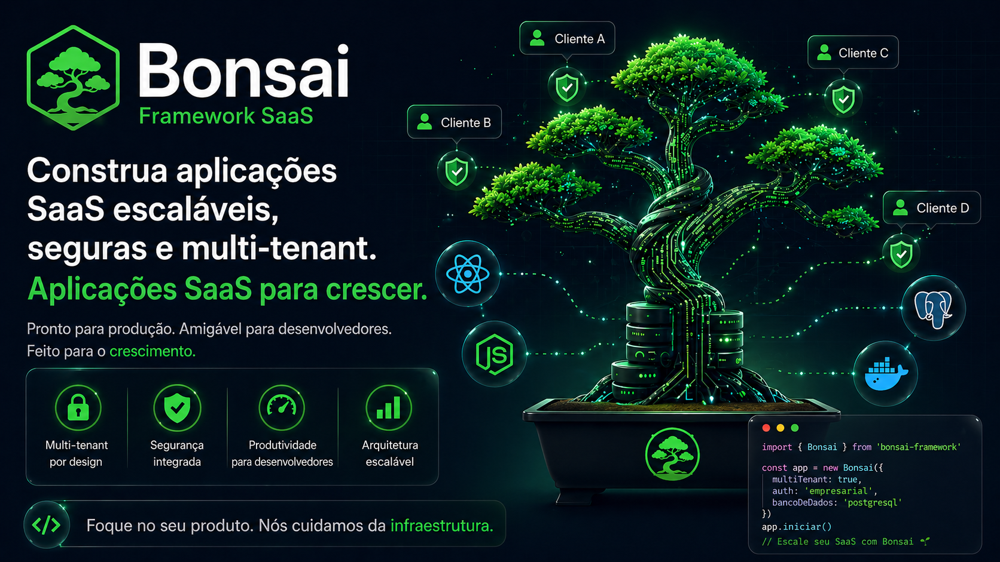

<div align="center">



[](https://github.com/eutiagobasei/bonsai-saas)
[](https://nestjs.com)
[](https://nextjs.org)
[](https://postgresql.org)
[](LICENSE)

</div>

# Bonsai SaaS Framework

---

## O que é o Bonsai?

Bonsai é um **framework/boilerplate** para construir aplicações SaaS multi-tenant. Não é uma aplicação pronta - é uma **base sólida** com padrões de segurança, autenticação e arquitetura já implementados para você construir seu produto em cima.

### Para quem é?

- **Desenvolvedores** que querem criar um SaaS sem reinventar a roda
- **Startups** que precisam de uma base segura e escalável
- **Agências** que desenvolvem produtos SaaS para clientes

### O que vem pronto?

| Funcionalidade | Status | O que faz |
|----------------|--------|-----------|
| Multi-tenancy | ✅ | Cada cliente tem seus dados isolados |
| Autenticação | ✅ | Login, registro, refresh token |
| Autorização | ✅ | Roles: Owner, Admin, Member, Viewer |
| CRUD Abstrato | ✅ | Base para criar CRUDs rapidamente |
| Rate Limiting | ✅ | Proteção contra abuso de API |
| Logs Estruturados | ✅ | Logs em JSON para análise |
| Cache Redis | ✅ | Performance otimizada |
| Docker | ✅ | Ambiente de dev e prod |
| CI/CD | ✅ | GitHub Actions configurado |

---

## Início Rápido (5 minutos)

### Pré-requisitos

- **Node.js 20+** - [Baixar](https://nodejs.org)
- **Docker Desktop** - [Baixar](https://docker.com/products/docker-desktop)
- **Git** - [Baixar](https://git-scm.com)

### Passo 1: Clone o projeto

```bash
git clone https://github.com/eutiagobasei/bonsai-saas.git
cd my-saas
```

### Passo 2: Instale as dependências

```bash
npm install
```

### Passo 3: Configure o ambiente

```bash
# Copie os arquivos de exemplo
cp apps/api/.env.example apps/api/.env
cp apps/web/.env.local.example apps/web/.env.local
```

### Passo 4: Suba o banco de dados

```bash
# Inicia PostgreSQL e Redis no Docker
npm run docker:up

# Aguarde alguns segundos e rode as migrations
npm run db:migrate
```

### Passo 5: Inicie os servidores

```bash
npm run dev
```

### Pronto! Acesse:

| Serviço | URL | Descrição |
|---------|-----|-----------|
| **Frontend** | http://localhost:3001 | Interface do usuário |
| **API** | http://localhost:3000 | Backend REST |
| **API Docs** | http://localhost:3000/api/docs | Swagger/OpenAPI |

---

## Entendendo a Arquitetura

### Estrutura de Pastas

```
bonsai/
├── apps/
│   ├── api/                 # 🔧 Backend NestJS
│   │   ├── src/
│   │   │   ├── common/      # Código compartilhado
│   │   │   │   ├── crud/    # BaseCrudService
│   │   │   │   ├── guards/  # Autenticação/Autorização
│   │   │   │   └── database/# Prisma + Multi-tenant
│   │   │   └── modules/     # Funcionalidades
│   │   │       ├── auth/    # Login, registro
│   │   │       ├── tenants/ # Gestão de organizações
│   │   │       └── users/   # Gestão de usuários
│   │   └── prisma/          # Schema do banco
│   │
│   └── web/                 # 🎨 Frontend Next.js
│       └── src/
│           ├── app/         # Páginas (App Router)
│           ├── components/  # Componentes React
│           ├── hooks/       # useCrudPage, useAuth
│           └── lib/         # API client, utils
│
└── infra/
    └── docker/              # Docker Compose
```

---

## O que é Multi-Tenancy? (Explicação Simples)

Imagine que você criou um software de gestão. Agora três empresas querem usar:
- Empresa A (Padaria)
- Empresa B (Pet Shop)
- Empresa C (Consultoria)

**Problema:** Como garantir que a Padaria não veja os dados do Pet Shop?

**Solução Multi-tenant:** Cada empresa é um "tenant" (inquilino). O Bonsai garante que:

```
┌─────────────────────────────────────────────────────┐
│                    Banco de Dados                    │
├─────────────────────────────────────────────────────┤
│  Dados da Padaria     │  Dados do Pet Shop          │
│  - produtos           │  - produtos                  │
│  - vendas             │  - vendas                    │
│  - clientes           │  - clientes                  │
│                       │                              │
│  🔒 ISOLADO           │  🔒 ISOLADO                  │
└─────────────────────────────────────────────────────┘
```

### Como funciona no código?

Toda tabela que precisa de isolamento tem uma coluna `tenantId`:

```sql
-- Exemplo: tabela de produtos
CREATE TABLE products (
  id          TEXT PRIMARY KEY,
  tenant_id   TEXT NOT NULL,  -- 👈 Identifica o dono
  name        TEXT NOT NULL,
  price       DECIMAL(10,2)
);
```

O framework **automaticamente** filtra por tenant:
- Usuário da Padaria faz login → vê só produtos da Padaria
- Usuário do Pet Shop faz login → vê só produtos do Pet Shop

---

## Criando seu Primeiro CRUD (Tutorial Completo)

Vamos criar um módulo de **Produtos** passo a passo.

### Passo 1: Adicione o modelo no Prisma

Edite `apps/api/prisma/schema.prisma`:

```prisma
model Product {
  id          String   @id @default(cuid())
  tenantId    String   @map("tenant_id")
  name        String
  description String?
  price       Decimal  @db.Decimal(10, 2)
  stock       Int      @default(0)
  isActive    Boolean  @default(true) @map("is_active")
  createdAt   DateTime @default(now()) @map("created_at")
  updatedAt   DateTime @updatedAt @map("updated_at")

  tenant      Tenant   @relation(fields: [tenantId], references: [id], onDelete: Cascade)

  @@unique([tenantId, name])
  @@index([tenantId])
  @@map("products")
}
```

Rode a migration:

```bash
npm run db:migrate
```

### Passo 2: Crie os DTOs (Data Transfer Objects)

Crie `apps/api/src/modules/products/dto/create-product.dto.ts`:

```typescript
import { IsString, IsNumber, IsOptional, Min, MaxLength } from 'class-validator';

export class CreateProductDto {
  @IsString()
  @MaxLength(100)
  name: string;

  @IsOptional()
  @IsString()
  @MaxLength(500)
  description?: string;

  @IsNumber()
  @Min(0)
  price: number;

  @IsOptional()
  @IsNumber()
  @Min(0)
  stock?: number;
}
```

Crie `apps/api/src/modules/products/dto/update-product.dto.ts`:

```typescript
import { PartialType } from '@nestjs/swagger';
import { IsOptional, IsBoolean } from 'class-validator';
import { CreateProductDto } from './create-product.dto';

export class UpdateProductDto extends PartialType(CreateProductDto) {
  @IsOptional()
  @IsBoolean()
  isActive?: boolean;
}
```

### Passo 3: Crie o Service (apenas 20 linhas!)

Crie `apps/api/src/modules/products/products.service.ts`:

```typescript
import { Injectable } from '@nestjs/common';
import { PrismaService } from '../../common/database/prisma.service';
import { BaseCrudService } from '../../common/crud';
import { Product } from '@prisma/client';
import { CreateProductDto } from './dto/create-product.dto';
import { UpdateProductDto } from './dto/update-product.dto';

@Injectable()
export class ProductsService extends BaseCrudService<
  Product,
  CreateProductDto,
  UpdateProductDto
> {
  // Nome do modelo no Prisma
  protected readonly modelName = 'product';

  // Campo único por tenant (evita duplicatas)
  protected readonly uniqueField = 'name';

  // Ordenação padrão
  protected readonly defaultOrderBy = { name: 'asc' as const };

  constructor(prisma: PrismaService) {
    super(prisma);
  }
}
```

**É só isso!** O `BaseCrudService` já fornece:
- `create()` - Criar produto
- `findAll()` - Listar produtos
- `findById()` - Buscar por ID
- `update()` - Atualizar
- `delete()` - Remover

### Passo 4: Crie o Controller

Crie `apps/api/src/modules/products/products.controller.ts`:

```typescript
import {
  Controller,
  Get,
  Post,
  Patch,
  Delete,
  Body,
  Param,
  Query,
  UseGuards,
  HttpCode,
  HttpStatus,
} from '@nestjs/common';
import { ApiTags, ApiBearerAuth } from '@nestjs/swagger';
import { ProductsService } from './products.service';
import { CreateProductDto } from './dto/create-product.dto';
import { UpdateProductDto } from './dto/update-product.dto';
import { CurrentTenant } from '../../common/decorators/current-tenant.decorator';
import { TenantGuard } from '../../common/guards/tenant.guard';

@ApiTags('products')
@ApiBearerAuth('JWT-auth')
@Controller('products')
@UseGuards(TenantGuard)  // 👈 Garante isolamento por tenant
export class ProductsController {
  constructor(private readonly service: ProductsService) {}

  @Post()
  create(
    @CurrentTenant() tenantId: string,  // 👈 Injetado automaticamente
    @Body() dto: CreateProductDto,
  ) {
    return this.service.create(tenantId, dto);
  }

  @Get()
  findAll(
    @CurrentTenant() tenantId: string,
    @Query('includeInactive') includeInactive?: string,
  ) {
    return this.service.findAll(tenantId, {
      includeInactive: includeInactive === 'true'
    });
  }

  @Get(':id')
  findById(
    @CurrentTenant() tenantId: string,
    @Param('id') id: string,
  ) {
    return this.service.findById(tenantId, id);
  }

  @Patch(':id')
  update(
    @CurrentTenant() tenantId: string,
    @Param('id') id: string,
    @Body() dto: UpdateProductDto,
  ) {
    return this.service.update(tenantId, id, dto);
  }

  @Delete(':id')
  @HttpCode(HttpStatus.NO_CONTENT)
  delete(
    @CurrentTenant() tenantId: string,
    @Param('id') id: string,
  ) {
    return this.service.delete(tenantId, id);
  }
}
```

### Passo 5: Crie o Module e Registre

Crie `apps/api/src/modules/products/products.module.ts`:

```typescript
import { Module } from '@nestjs/common';
import { ProductsController } from './products.controller';
import { ProductsService } from './products.service';

@Module({
  controllers: [ProductsController],
  providers: [ProductsService],
  exports: [ProductsService],
})
export class ProductsModule {}
```

Adicione em `apps/api/src/app.module.ts`:

```typescript
import { ProductsModule } from './modules/products/products.module';

@Module({
  imports: [
    // ... outros imports
    ProductsModule,  // 👈 Adicione aqui
  ],
})
export class AppModule {}
```

### Pronto! Teste sua API

```bash
# Criar produto
curl -X POST http://localhost:3000/products \
  -H "Authorization: Bearer SEU_TOKEN" \
  -H "Content-Type: application/json" \
  -d '{"name": "Produto Teste", "price": 29.90}'

# Listar produtos
curl http://localhost:3000/products \
  -H "Authorization: Bearer SEU_TOKEN"
```

---

## Criando a Página no Frontend

### Passo 1: Adicione o API Client

Em `apps/web/src/lib/api.ts`, adicione:

```typescript
// Tipos
export interface Product {
  id: string;
  tenantId: string;
  name: string;
  description?: string;
  price: number;
  stock: number;
  isActive: boolean;
  createdAt: string;
  updatedAt: string;
}

export interface CreateProductData {
  name: string;
  description?: string;
  price: number;
  stock?: number;
}

export interface UpdateProductData extends Partial<CreateProductData> {
  isActive?: boolean;
}

// API Client
export const productApi = createCrudApi<Product>('/products');
```

### Passo 2: Crie a Página

Crie `apps/web/src/app/(dashboard)/products/page.tsx`:

```tsx
'use client';

import { productApi, Product, CreateProductData } from '@/lib/api';
import { useCrudPage } from '@/hooks/use-crud-page';
import { Button } from '@/components/ui/Button';
import { Input } from '@/components/ui/Input';
import { Modal } from '@/components/ui/Modal';
import { PackageIcon } from '@/components/icons';
import {
  CrudPageHeader,
  CrudEmptyState,
  CrudDeleteModal,
  CrudLoadingState,
  CrudErrorAlert,
} from '@/components/crud';
import { formatCurrency } from '@/lib/utils';

export default function ProductsPage() {
  // Hook mágico que gerencia todo o CRUD
  const crud = useCrudPage<Product, CreateProductData>({
    api: productApi,
    entityName: 'produto',
    defaultFormData: { name: '', description: '', price: 0, stock: 0 },
  });

  if (crud.isLoading) return <CrudLoadingState />;

  return (
    <div className="space-y-6">
      {/* Header */}
      <CrudPageHeader
        title="Produtos"
        description="Gerencie seus produtos"
        createLabel="Novo Produto"
        onCreateClick={crud.openCreateModal}
      />

      {/* Erro */}
      {crud.error && <CrudErrorAlert message={crud.error} />}

      {/* Lista ou Estado Vazio */}
      {crud.items.length === 0 ? (
        <CrudEmptyState
          icon={<PackageIcon className="w-12 h-12" />}
          title="Nenhum produto"
          description="Comece adicionando seu primeiro produto."
          createLabel="Novo Produto"
          onCreateClick={crud.openCreateModal}
        />
      ) : (
        <div className="grid gap-4 md:grid-cols-2 lg:grid-cols-3">
          {crud.items.map((product) => (
            <div
              key={product.id}
              className="p-4 border rounded-lg hover:border-primary-500"
            >
              <h3 className="font-semibold">{product.name}</h3>
              <p className="text-sm text-gray-500">{product.description}</p>
              <p className="mt-2 text-lg font-bold text-primary-600">
                {formatCurrency(product.price)}
              </p>
              <p className="text-sm text-gray-400">
                Estoque: {product.stock}
              </p>
              <div className="flex gap-2 mt-4">
                <Button
                  size="sm"
                  variant="secondary"
                  onClick={() => crud.openEditModal(product)}
                >
                  Editar
                </Button>
                <Button
                  size="sm"
                  variant="danger"
                  onClick={() => crud.confirmDelete(product)}
                >
                  Excluir
                </Button>
              </div>
            </div>
          ))}
        </div>
      )}

      {/* Modal de Criar/Editar */}
      <Modal
        isOpen={crud.isModalOpen}
        onClose={crud.closeModal}
        title={crud.editingItem ? 'Editar Produto' : 'Novo Produto'}
      >
        <form onSubmit={crud.handleSubmit} className="space-y-4">
          <Input
            label="Nome"
            value={crud.formData.name}
            onChange={(e) => crud.updateFormField('name', e.target.value)}
            required
          />
          <Input
            label="Descrição"
            value={crud.formData.description || ''}
            onChange={(e) => crud.updateFormField('description', e.target.value)}
          />
          <Input
            label="Preço"
            type="number"
            step="0.01"
            min="0"
            value={crud.formData.price}
            onChange={(e) => crud.updateFormField('price', parseFloat(e.target.value))}
            required
          />
          <Input
            label="Estoque"
            type="number"
            min="0"
            value={crud.formData.stock || 0}
            onChange={(e) => crud.updateFormField('stock', parseInt(e.target.value))}
          />
          <div className="flex justify-end gap-3 pt-4">
            <Button type="button" variant="secondary" onClick={crud.closeModal}>
              Cancelar
            </Button>
            <Button type="submit" isLoading={crud.isSaving}>
              {crud.editingItem ? 'Salvar' : 'Criar'}
            </Button>
          </div>
        </form>
      </Modal>

      {/* Modal de Confirmação de Exclusão */}
      <CrudDeleteModal
        isOpen={!!crud.deleteConfirm}
        onClose={crud.cancelDelete}
        onConfirm={crud.handleDelete}
        isDeleting={crud.isDeleting}
        entityName="o produto"
        itemName={crud.deleteConfirm?.name}
      />
    </div>
  );
}
```

### Passo 3: Adicione ao Menu

Em `apps/web/src/components/layout/Sidebar.tsx`:

```typescript
const menuItems = [
  // ... outros itens
  { name: 'Produtos', href: '/products', icon: PackageIcon },
];
```

---

## Personalizando Validações

O `BaseCrudService` tem hooks que você pode sobrescrever:

```typescript
@Injectable()
export class ProductsService extends BaseCrudService<...> {
  // ... código anterior

  /**
   * Validação antes de criar
   */
  protected async validateCreate(tenantId: string, dto: CreateProductDto): Promise<void> {
    if (dto.price < 0) {
      throw new BadRequestException('Preço não pode ser negativo');
    }
  }

  /**
   * Validação antes de atualizar
   */
  protected async validateUpdate(
    tenantId: string,
    id: string,
    dto: UpdateProductDto,
    existing: Product,
  ): Promise<void> {
    // Exemplo: não permitir reduzir estoque abaixo de zero
    if (dto.stock !== undefined && dto.stock < 0) {
      throw new BadRequestException('Estoque não pode ser negativo');
    }
  }

  /**
   * Validação antes de deletar
   */
  protected async validateDelete(tenantId: string, id: string): Promise<void> {
    // Exemplo: verificar se produto tem vendas
    const salesCount = await this.prisma.sale.count({
      where: { productId: id },
    });

    if (salesCount > 0) {
      throw new BadRequestException(
        `Produto tem ${salesCount} vendas. Remova as vendas primeiro.`
      );
    }
  }
}
```

---

## Segurança (Já Implementado)

O Bonsai vem com múltiplas camadas de proteção:

### Autenticação

```
Usuário faz login
       ↓
┌──────────────────────┐
│ JWT Access Token     │ ← Expira em 15 minutos
│ (enviado no header)  │
└──────────────────────┘
       +
┌──────────────────────┐
│ Refresh Token        │ ← Expira em 7 dias
│ (cookie HttpOnly)    │ ← JavaScript não consegue acessar
└──────────────────────┘
```

### Isolamento de Dados (Defense in Depth)

```
Request com Token JWT
        ↓
┌─────────────────────┐
│ 1. JWT Guard        │ → Verifica se token é válido
└─────────────────────┘
        ↓
┌─────────────────────┐
│ 2. Tenant Guard     │ → Verifica se user pertence ao tenant
└─────────────────────┘
        ↓
┌─────────────────────┐
│ 3. Interceptor      │ → Configura contexto do tenant
└─────────────────────┘
        ↓
┌─────────────────────┐
│ 4. Prisma Middleware│ → Filtra automaticamente por tenantId
└─────────────────────┘
        ↓
   Dados do Tenant
```

### Rate Limiting

| Janela | Limite | Descrição |
|--------|--------|-----------|
| 1 segundo | 3 requests | Proteção contra flood |
| 10 segundos | 20 requests | Uso normal |
| 60 segundos | 100 requests | Limite geral |

---

## Comandos Úteis

### Desenvolvimento

```bash
npm run dev           # Inicia API + Web
npm run docker:up     # Sobe PostgreSQL + Redis
npm run docker:down   # Para os containers
npm run db:migrate    # Roda migrations
npm run db:studio     # Abre Prisma Studio (GUI do banco)
```

### Qualidade

```bash
npm run lint          # Verifica erros de código
npm run type-check    # Verifica tipos TypeScript
npm run test          # Roda testes
npm run test:cov      # Testes com cobertura
```

### Produção

```bash
npm run build         # Compila para produção
npm run start         # Inicia em modo produção
```

---

## Histórico de Versões

| Versão | Nome | Principais Features |
|--------|------|---------------------|
| **1.5.0** | Bonsai Branding | Configuração centralizada de marca |
| **1.4.0** | Multi-Tenant Schema Isolation | Funções RLS, correção do interceptor |
| **1.3.0** | SaaS REST Security | Checklist 10/10 de segurança |
| **1.1.0** | Security Framework & CRUD | BaseCrudService, abstrações |
| **1.0.0** | Initial Release | Framework base |

---

## Estrutura do Banco

```
PostgreSQL (saas_dev)
│
├── public schema (compartilhado)
│   ├── users            → Usuários do sistema
│   ├── tenants          → Organizações/Empresas
│   ├── tenant_members   → Relação usuário ↔ tenant
│   ├── refresh_tokens   → Tokens de renovação
│   ├── sessions         → Sessões ativas
│   └── audit_logs       → Log de operações sensíveis
│
├── tenant_empresa_a schema (isolado)
│   └── [suas tabelas de negócio]
│
└── tenant_empresa_b schema (isolado)
    └── [suas tabelas de negócio]
```

---

## FAQ

### Posso usar com outro banco de dados?

O Prisma suporta PostgreSQL, MySQL, SQLite e SQL Server. Para trocar, altere o `provider` no `schema.prisma` e ajuste o `DATABASE_URL`.

### Como faço deploy?

O projeto já vem com GitHub Actions configurado. Veja `.github/workflows/` para CI/CD.

### Onde configuro o nome/marca?

Edite os arquivos de branding:
- Backend: `apps/api/src/config/branding.ts`
- Frontend: `apps/web/src/config/branding.ts`

### Como adiciono autenticação social (Google, GitHub)?

O NestJS Passport facilita isso. Crie uma nova strategy em `apps/api/src/modules/auth/strategies/`.

---

## Contribuindo

1. Fork o projeto
2. Crie uma branch (`git checkout -b feature/nova-feature`)
3. Commit suas mudanças (`git commit -m 'feat: adiciona nova feature'`)
4. Push para a branch (`git push origin feature/nova-feature`)
5. Abra um Pull Request

---

## Licença

MIT License - veja [LICENSE](LICENSE) para detalhes.

---

<div align="center">

**Feito com** NestJS, Next.js, Prisma, PostgreSQL, Redis e Docker.

[Documentação](wiki/) · [Reportar Bug](https://github.com/eutiagobasei/bonsai-saas/issues) · [Solicitar Feature](https://github.com/eutiagobasei/bonsai-saas/issues)

</div>
